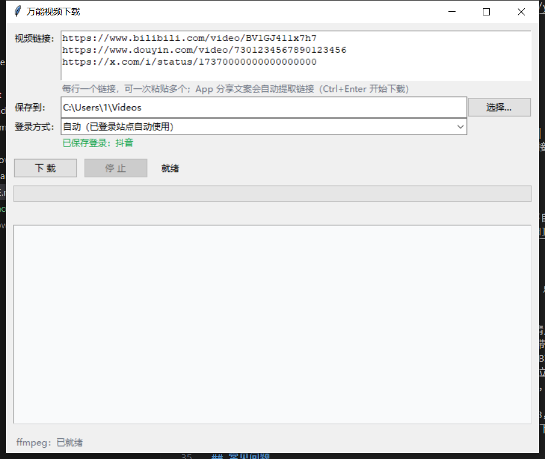

# 万能视频下载 Any Video Downloader

[](LICENSE)
[](https://www.python.org/)
[](#)
[](https://github.com/yt-dlp/yt-dlp)

粘贴链接即下的免费 Windows 视频下载器（图形界面，免安装绿色单文件 exe）。
B站 / 抖音 / 微博 / 西瓜 / X(Twitter) / YouTube 等上千个站点，
支持**批量下载**、**内置登录窗口**、**自动代理探测**、**自动配置 ffmpeg**。

Free GUI video downloader for Windows, powered by [yt-dlp](https://github.com/yt-dlp/yt-dlp).
Paste a link (or a whole list) and download — supports 1000+ sites including
Bilibili, Douyin, Weibo, X (Twitter), YouTube and TikTok, with built-in login,
batch download and auto proxy detection. Single portable exe, no installation.



## 功能特性

- **批量下载**：多行粘贴多个链接一次全下（每行一个，顺序下载，逐个汇报成败）；
  也能直接粘贴 App 分享文案，程序自动提取其中的链接（含抖音弹窗短链转直链）
- **内置登录窗口**：下载需要登录的内容（X 视频、抖音、B站高清/会员）时自动弹出
  登录窗口，扫码/输密码登录一次即长期生效；登录信息保存在程序自己的目录，
  不读取日常浏览器的加密 cookies，不受新版 Chrome App-Bound Encryption 影响
- **自动代理探测**：下载 X / YouTube 等被墙站点时自动使用本地代理
  （Clash 7890、v2rayN 10809 等常见端口，无需手动配置）
- **ffmpeg 全自动**：合并高清音视频所需，首次下载自动获取，无需人工干预
- **免安装绿色软件**：单个 exe，双击即用，不写注册表；下载的登录状态、
  ffmpeg 等数据集中在 `%LOCALAPPDATA%\VideoDownloader`
- **中文错误翻译**：常见报错（需要登录、地区限制、请求频繁、站点改版等）
  翻译成能看懂的中文提示，而不是一串英文堆栈

## 站点支持情况（2026-09 实测）

| 站点 | 状态 | 说明 |
|------|------|------|
| B站（哔哩哔哩） | 直接可用 | 免登录可下 480P；登录后更高清 |
| 微博 / AcFun | 直接可用 | 游客即可下载 |
| 西瓜视频 | 需验证 | 首次下载自动弹窗获取验证信息（不必登录）|
| 抖音 | 需登录 | 首次下载自动弹登录窗口，扫码登录一次即可；直接粘贴 App 分享文案也行 |
| 知乎 | 部分支持 | 部分视频可下，视具体内容而定 |
| 快手 | 不支持 | yt-dlp 官方已移除其解析器 |
| 小红书 | 不支持 | 无公开解析途径 |

> 海外站（X/Twitter、YouTube、TikTok 等）需开启代理软件，程序自动探测常见端口。
> 其他 yt-dlp 支持的站点（[完整列表](https://github.com/yt-dlp/yt-dlp/blob/master/supportedsites.md)）同样可下。

## 下载与使用

普通用户：到 **[Releases 页面](../../releases)** 下载 exe，双击运行（无需安装 Python）。

1. 粘贴视频链接（每行一个，可一次粘贴多个）
2. 点"下载"或按 `Ctrl+Enter`
3. 需要登录时会自动弹出登录窗口，登录后自动继续；剩余链接自动接着下

- **保存位置**：默认 `我的文档\Videos`，可自行更换
- **登录方式**：默认"自动"——已保存登录的站点自动使用其登录状态；
  也可在下拉框手动触发"登录 X (Twitter)…"、"登录 B站…"等
- **ffmpeg**：首次下载时自动获取（约 160MB，只需一次，存放在
  `%LOCALAPPDATA%\VideoDownloader\ffmpeg`），之后所有下载均为高清

## 常见问题

| 问题 | 说明 |
|------|------|
| X（Twitter）/ YouTube 下载需要什么 | 两件事：1) **开代理软件**（程序自动探测 Clash 7890 / v2rayN 10809 等常见端口，无需配置）；2) 部分推文需要登录（会自动弹登录窗口）。公开推文开代理即可直接下载 |
| 提示"无法连接到该网站" | 被墙站点直连被阻断。开启代理软件后重试；若代理端口不在常见列表，请在代理软件里开启"系统代理"或改为常见端口 |
| 弹出登录窗口 | 这是正常流程：视频需要登录才能下载，在弹出的窗口里登录，登录成功后程序自动继续下载（批量下载时自动从断点接着下） |
| B站只有 480P | 未登录状态的上限。用"登录 B站…"弹窗登录后可拿更高清晰度（会员清晰度需大会员账号） |
| 提示"请求过于频繁" | 站点风控（短时间内请求过多），等几分钟再试 |
| 提示"解析失败（站点改版）" | 视频网站更新了反爬机制，需要升级 yt-dlp 后重新打包（见下方开发说明） |
| exe 被杀毒软件误报 | PyInstaller 单文件 exe 的常见误报。添加信任即可；介意的话可改用 `--onedir` 模式打包 |
| 下载速度慢 | 程序默认 4 线程下载分片；网络原因的慢速无法从程序侧解决 |

## 开发说明

环境：Python 3.10+

```bash
python -m venv venv
venv\Scripts\python -m pip install yt-dlp pyinstaller

# 运行界面（--demo 为预填示例链接的演示模式）
venv\Scripts\python app.py [--demo]

# 重新打包（修改代码后）
build.bat

# 打包自检（验证 exe 内 yt-dlp 完整性，结果写入 selftest_result.txt）
dist\VideoDownloader.exe --selftest

# 重新截取界面截图 -> docs/screenshot.png
powershell -File screenshot.ps1
```

### 文件结构

| 文件 | 职责 |
|------|------|
| `app.py` | GUI 入口（tkinter）：多链接输入、进度、日志、线程调度、批量与登录向导交互 |
| `downloader.py` | 核心下载：封装 yt-dlp，链接规范化（含分享文案提取）、进度回调与错误翻译 |
| `login_browser.py` | 站点登录向导：CDP 弹窗登录、cookies 存档、UA 记录 |
| `proxy_manager.py` | 本地代理探测（被墙站点自动走 Clash/v2rayN 等常见端口） |
| `ffmpeg_manager.py` | ffmpeg 检测与自动下载（npmmirror / gyan.dev / GitHub 三源容错） |
| `build.bat` | 一键重新打包 |
| `screenshot.ps1` | 重新生成 README 用界面截图 |

## License

[MIT](LICENSE)

---

## 关键词 Keywords

视频下载器 · 免费视频下载软件 · yt-dlp 图形界面 · yt-dlp GUI · 视频下载工具 ·
B站视频下载 · 哔哩哔哩视频下载 · 抖音视频下载无水印 · 微博视频下载 · 西瓜视频下载 ·
Twitter 视频下载 · X 视频下载 · YouTube 下载器 · TikTok 下载 · 批量下载 · Windows · 绿色软件

free video downloader · yt-dlp gui · yt-dlp frontend · video downloader for windows ·
bilibili video downloader · douyin video downloader · weibo video downloader ·
twitter video downloader · youtube downloader · tiktok downloader · batch download ·
tkinter · python · portable · no installation
